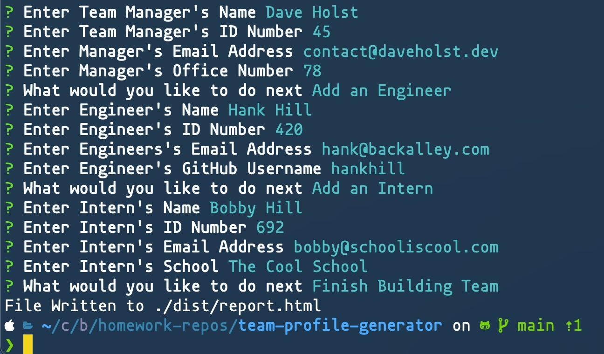
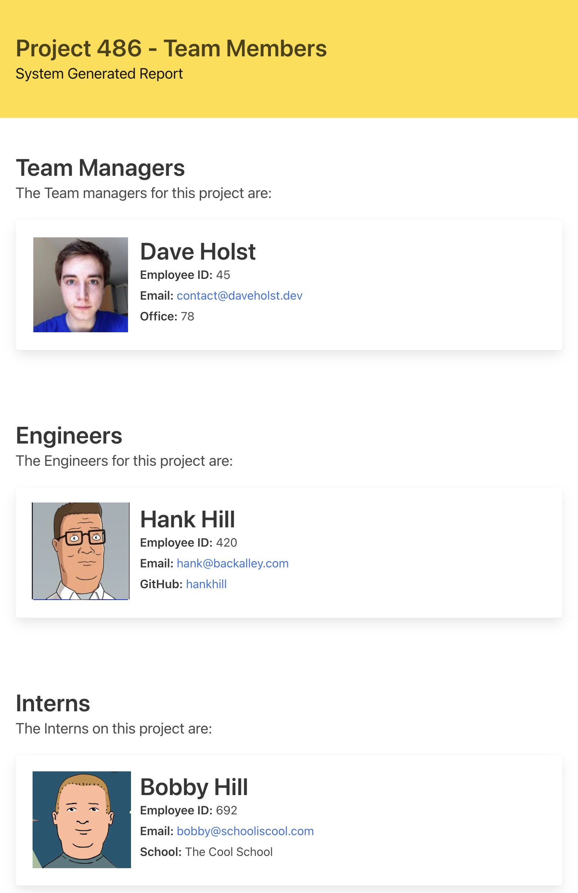

# Team Profile Generator

Node.JS app that generates a HTML report of employees from user Input via CLI

# Readme Generator

This is a program that uses Node.JS and inquirer to build a list of team members from the command line and output a styled html page that includes all team members.

## Table of Contents:

- [License](#License)
- [Installation](#Installation)
- [Usage](#Usage)
- [Tests](#Tests)
- [Tech Stack](#Tech-Stack)
- [Questions](#Questions)

## License

[](https://opensource.org/licenses/MIT)

This project is licensed under the **MIT License**: https://opensource.org/licenses/MIT

## Screenshots

#### YouTube video demonstrating how to use the application:

[](http://www.youtube.com/watch?v=PCDo1_-s0aY)

#### Still Screenshot - CLI:



#### Still Screenshot - Generated Report:



## Installation

The program can be installed using the following steps.

1. Clone the Repo
   Navigate to appropriate directory and clone from GitHub:

```bash
git clone https://github.com/daveholst/team-profile-generator
```

2. Install Dependencies
   Navigate to where the directory has been cloned to:

```bash
cd team-profile-generator/
npm install
```

## Usage

To use the program simply run the program from your preferred terminal and follow the prompts.

```bash
npm start
```

## Tests

Jest tests have been written for a majority of the codebase. To launch a jest watch session, run the following command.

```bash
npm test
```

## Tech Stack

- Jest: https://www.npmjs.com/package/jest
- WesBos Linter Config: https://github.com/wesbos/eslint-config-wesbos
- Inquirer: https://www.npmjs.com/package/inquirer
- Email Validator: https://www.npmjs.com/package/email-validator

## Questions

If you have any further questions you can get in contact with the creator through the following methods:

- https://github.com/daveholst/
- contact@daveholst.dev
